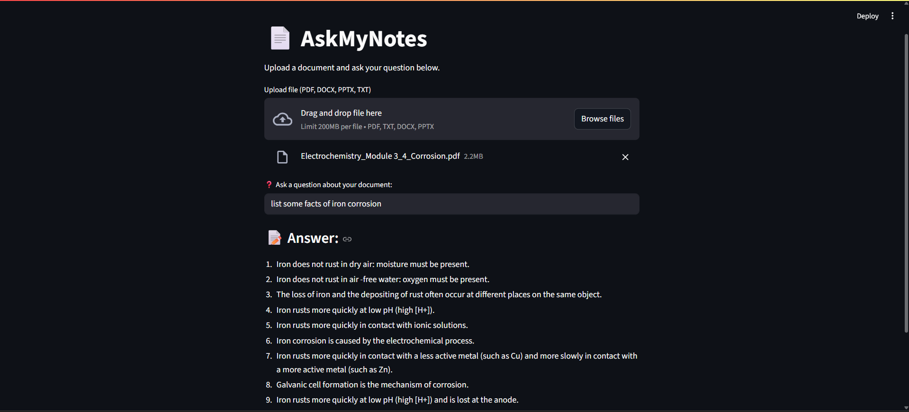
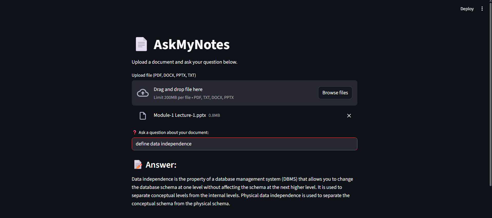
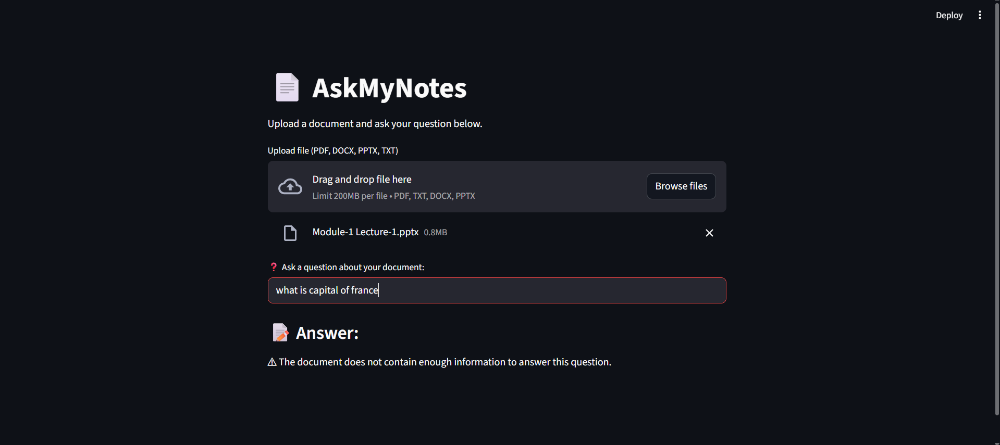
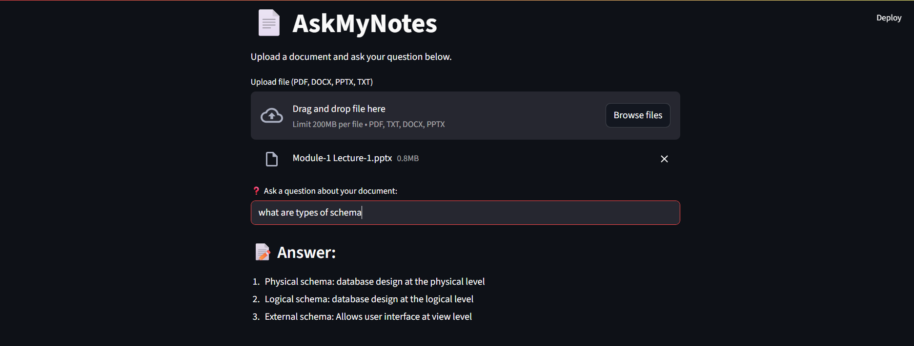

# 📄 AskMyNotes – Document-Based Q&A Assistant

**AskMyNotes** is an AI-powered Q&A web app that allows users to upload documents (PDF, DOCX, PPTX, or TXT) and ask questions to get **clear, context-aware answers** based on the content of their notes. It’s designed to reduce the time spent searching through documents and make learning or reviewing faster and smarter.

> 🧠 While it may not always return exact lines from the document, it intelligently simplifies or rephrases the information to improve user understanding — staying true to the source content.

---

## 🎯 Project Objective

> 📚 “Why search when you can just ask?”

The goal is to allow users — especially students and professionals — to interact with their study materials or lecture notes using natural questions. The app reads the document, breaks it into meaningful parts, understands the context, and gives a **concise, reliable answer** — without guessing or inventing.


---

## 💡 Features

- 📂 Upload support for **PDF, Word, PPTX, and TXT**
- 🤖 Uses **TinyLlama**, a local LLM, for on-device inference (no API needed)
- 🔍 Powered by **FAISS** and **MiniLM** embeddings for fast, meaningful retrieval
- ⚡ Returns **precise answers** using only the uploaded document — no hallucinations
- 🚫 If an answer isn't found in the document, it tells the user — no guessing
- 💬 Clean and simple UI with just what you need: **Upload → Ask → Answer**

---

## 🧠 How It Works

1. You upload a document.
2. The content is extracted and split into logical chunks.
3. These chunks are embedded using `MiniLM` and stored in a FAISS vector database.
4. When you ask a question:
   - It searches the most relevant chunks
   - Constructs a prompt using those chunks
   - TinyLlama generates an answer, rephrasing only what's in your notes
5. If no relevant answer is found, it clearly informs the user.

---

## 🔧 Technologies Used

| Component            | Tech Used                                        |
|----------------------|--------------------------------------------------|
| UI                   | Streamlit                                        |
| Text Extraction      | PyPDF2, python-docx, python-pptx                 |
| Embeddings           | sentence-transformers/all-MiniLM-L6-v2          |
| Vector Search        | FAISS (via Langchain)                            |
| LLM                  | TinyLlama 1.1B Chat (via HuggingFace)            |
| Chunking             | Langchain’s RecursiveCharacterTextSplitter       |

---

## 🖥️ How to Run It Locally

### 1. 📦 Install Requirements

```bash
pip install -r requirements.txt
```

> Make sure you are using Python 3.9 or above.

### 2. ▶️ Run the App

```bash
streamlit run test_app.py
```

Then open your browser and go to [http://localhost:8501](http://localhost:8501)

---

## 📁 File Structure

```
askmynotes/
├── test_app.py             # Streamlit app code
├── requirements.txt        # All required Python packages
├── README.md               # Project overview and instructions
├── sample_files/           # Test documents used for Q&A (PDF, PPTX, DOCX, TXT)
└── testing_screenshots/    # Screenshots of test cases and app outputs
```


---

## ✅ Sample Questions You Can Ask

| Document Type        | Example Questions                        |
|----------------------|------------------------------------------|
| Chemistry PDF        | "List some facts of iron corrosion"      |
| DBMS PPT             | "What is data independence?"             |
| Out-of-context Check | "What is the capital of France?"         |
| DBMS PPT             | "Define schema in DBMS"                  |


If your question is outside the document, AskMyNotes will respond:
> *"The document does not provide a definition for this."*

---

## 🧪 Testing Summary

This app was tested with multiple documents across domains:
- ✅ Gave clear definitions when found
- ✅ Did not hallucinate or add outside info
- ✅ Responded responsibly when context was missing
- ✅ Handled long documents and user mistakes gracefully

---

## 🖼️ Visual Testing Evidence

Below are real screenshots of AskMyNotes in action:

### 🔬 Corrosion Test


### 🧠 Data Independence Test


### 🚫 Out-of-Context Query Test


### 🗂️ Schema Understanding Test



---


## ✨ Why This Project Matters

This project shows how **AI can be used responsibly** to assist learning without misinformation. It also proves that with the right retrieval setup, even a lightweight model like TinyLlama can produce meaningful, grounded outputs — all on a standard laptop with no internet inference.

---

## 🚧 Model Choice & Limitations

Initially, I explored using larger models like GPT-4 and Phi-3 to improve answer quality and depth. However:

- OpenAI API usage comes with costs that are not feasible for a student project.
- Local deployment of Phi-3 and similar large models exceeded my laptop's 16GB RAM and caused performance issues.

As a result, I optimized the system to work with the lightweight **TinyLlama-1.1B**, which runs efficiently on local hardware while still providing relevant, grounded answers from uploaded documents.

This choice reflects a balance between accessibility, resource usage, and educational value.


---

## 🙋 Author

**Srikar Pittala**  
Student | Tech Enthusiast | Builder of AskMyNotes 🧠

---

## 🏁 Final Note

> This project is a combination of AI, UX thinking, and practical testing. Even if you’re not an expert in machine learning, AskMyNotes is proof that simple, helpful tools can make a big difference.
